# Web3Campaigns - Campaign Workflow Documentation

This document describes the complete workflow of the DappDrop campaign system, including how campaigns are created, tasks are added, rewards are set, and participants interact with the system.

---

## 📊 Smart Contract Architecture

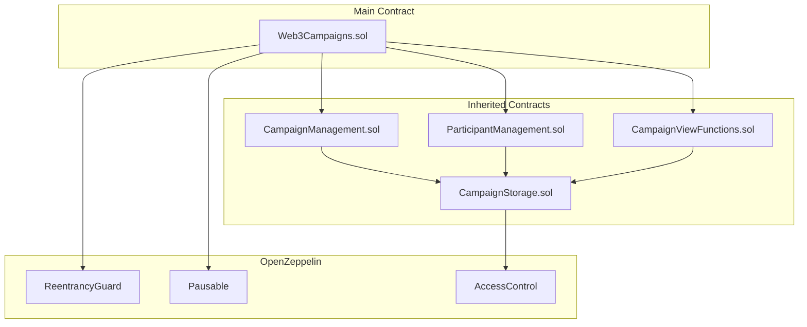

## 🏗️ Contract Responsibilities

| Contract | Purpose |
|----------|---------|
| **Web3Campaigns** | Main entry point; inherits all functionality; security wrappers |
| **CampaignManagement** | Campaign creation, task management, reward setting, lifecycle control |
| **ParticipantManagement** | Task completion, verification, reward claiming |
| **CampaignViewFunctions** | Read-only queries for campaign data |
| **CampaignStorage** | Shared data structures, state variables, modifiers, events |

---

## 📈 Campaign Lifecycle State Machine

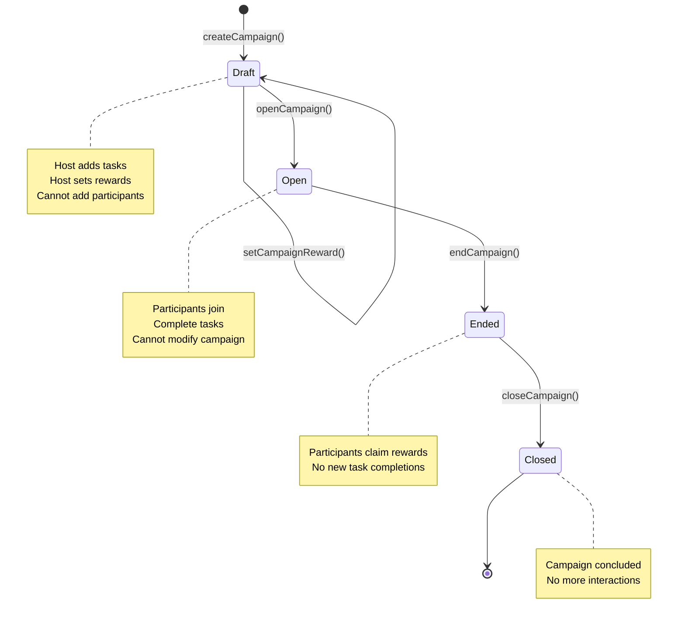

---

## 🎯 Campaign Status Descriptions

| Status | Description | Allowed Actions |
|--------|-------------|----------------|
| **Draft** | Campaign created, host is configuring | Add tasks, set rewards, open campaign |
| **Open** | Campaign active for participation | Complete tasks, track progress |
| **Ended** | Campaign period over | Claim rewards only |
| **Closed** | Fully concluded | No actions allowed |

---

## 🚀 Complete Campaign Workflow

### 1️⃣ Campaign Creation Flow

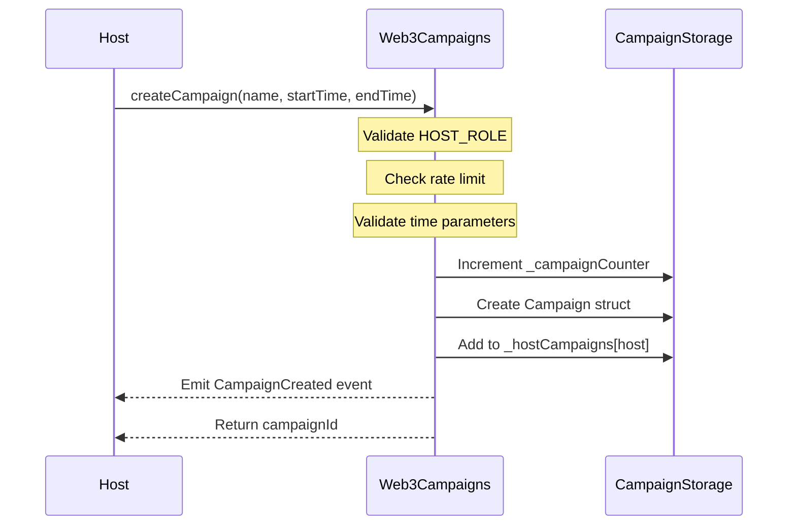

**Parameters:**
- `name`: Campaign name (1-200 characters)
- `startTime`: Must be > current time
- `endTime`: Must be > startTime

**Constraints:**
- Duration: minimum 1 hour, maximum 365 days
- Rate limit: 5 minutes between campaign creations

---

### 2️⃣ Adding Tasks Flow

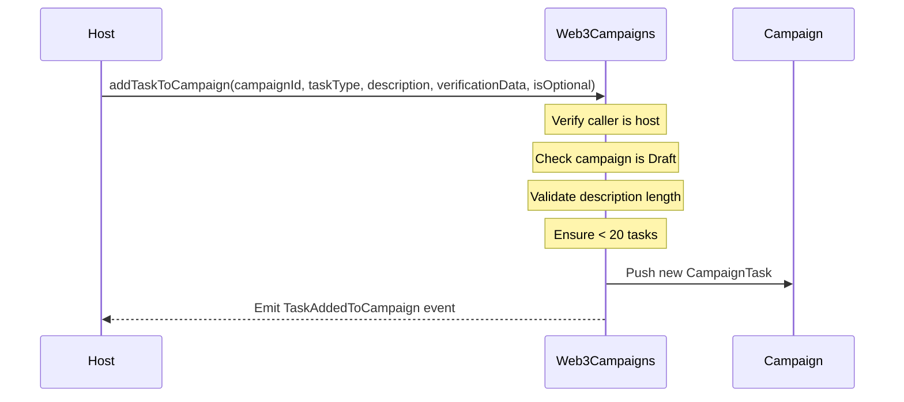

**Task Types Available:**

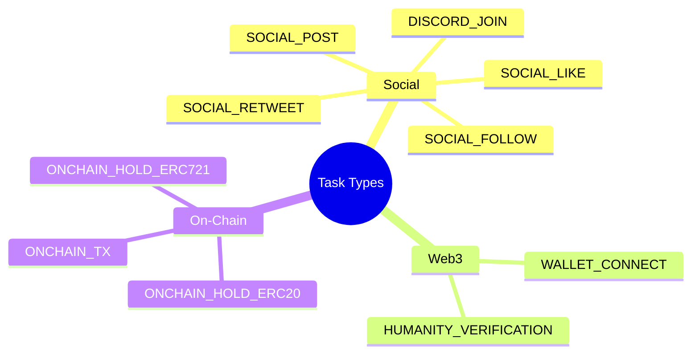

| Task Type | Verification Method | Description |
|-----------|---------------------|-------------|
| `SOCIAL_FOLLOW` | Off-chain/Host | Follow social media account |
| `SOCIAL_LIKE` | Off-chain/Host | Like a post |
| `SOCIAL_RETWEET` | Off-chain/Host | Retweet a tweet |
| `SOCIAL_POST` | Off-chain/Host | Make a post about campaign |
| `DISCORD_JOIN` | Off-chain/Host | Join Discord server |
| `WALLET_CONNECT` | Off-chain/Host | Connect wallet |
| `HUMANITY_VERIFICATION` | Off-chain/Host | CAPTCHA or human verification |
| `ONCHAIN_TX` | Oracle (not implemented) | Specific on-chain transaction |
| `ONCHAIN_HOLD_ERC20` | **On-chain automatic** | Hold minimum ERC-20 tokens |
| `ONCHAIN_HOLD_ERC721` | **On-chain automatic** | Hold specific NFT |

---

### 3️⃣ Setting Rewards Flow (Flexible Reward System v0.1.0)

The flexible reward system supports multiple reward types per campaign with different distribution modes.

#### ERC20 Fixed Distribution

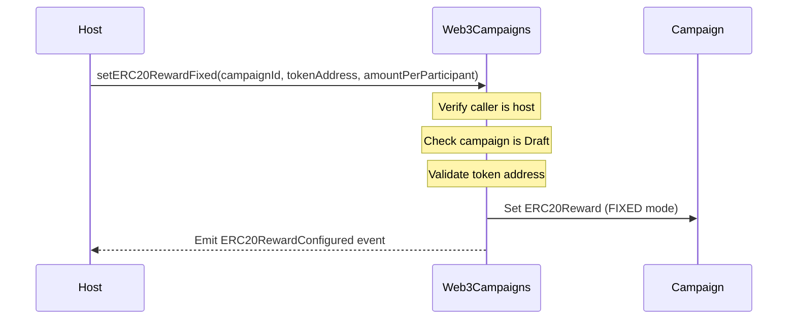

#### ERC20 Tiered Distribution

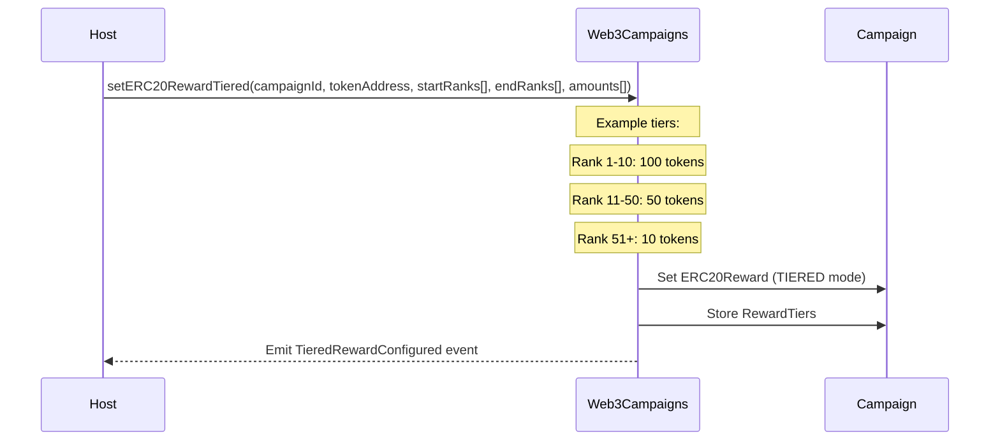

#### NFT Bulk Distribution

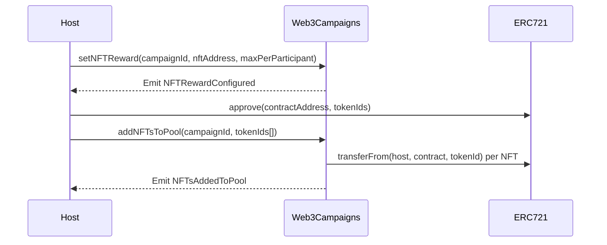

**Distribution Modes:**

| Mode | Description | Use Case |
|------|-------------|----------|
| `FIXED` | Same amount to all participants | 20 tokens to everyone |
| `TIERED` | Different amounts based on claim rank | First 10 get 100, next 40 get 50 |
| `FCFS` | First-come-first-served until exhausted | Limited pool of NFTs |

**Reward Configuration Functions:**

| Function | Purpose | Parameters |
|----------|---------|------------|
| `setERC20RewardFixed()` | Fixed token per participant | campaignId, tokenAddress, amount |
| `setERC20RewardTiered()` | Tiered based on claim order | campaignId, tokenAddress, startRanks[], endRanks[], amounts[] |
| `setNFTReward()` | Configure NFT distribution | campaignId, nftAddress, maxPerParticipant |
| `addNFTsToPool()` | Add NFTs to pool (bulk) | campaignId, tokenIds[] |
| `setOffChainReward()` | Whitelist/off-chain prizes | campaignId, description, metadata |

**Combined Rewards:**
You can configure multiple reward types for the same campaign (e.g., ERC20 + NFT + off-chain).

---


### 4️⃣ Campaign Activation Flow

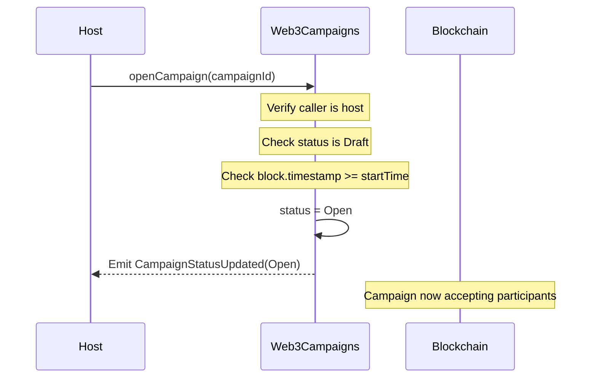

---

### 5️⃣ Participant Task Completion Flow

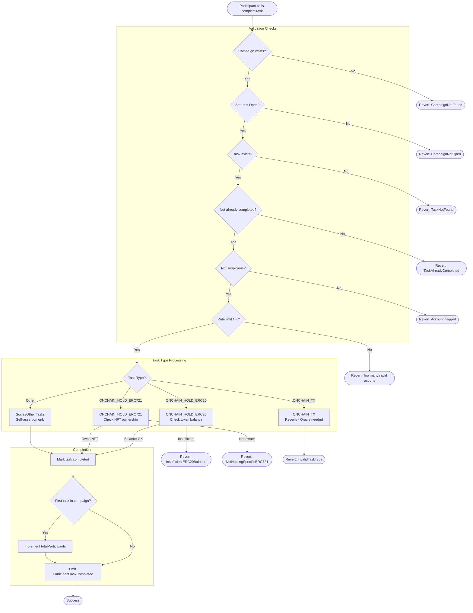

---

### 6️⃣ Host Task Verification Flow (Off-Chain Tasks)

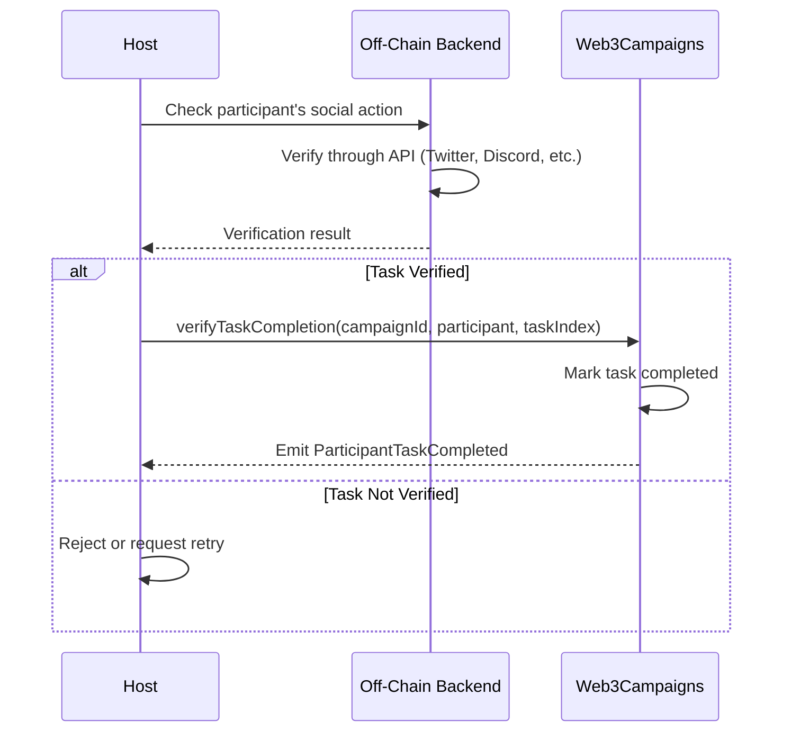

**Host Verification Restrictions:**
- ❌ Cannot verify: `ONCHAIN_TX`, `ONCHAIN_HOLD_ERC20`, `ONCHAIN_HOLD_ERC721`
- ✅ Can verify: All social/off-chain task types

---

### 7️⃣ Reward Claiming Flow

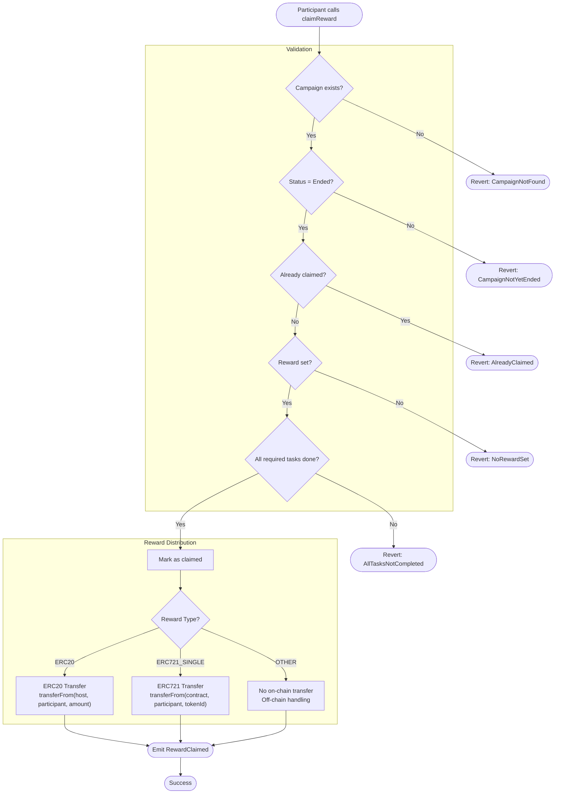

**Reward Transfer Requirements:**

| Type | Requirement |
|------|-------------|
| ERC20 | Host must have approved tokens to contract |
| ERC721_SINGLE | Contract must own the specific NFT |
| OTHER | No token transfer required |

---

### 8️⃣ Campaign Ending & Closing Flow

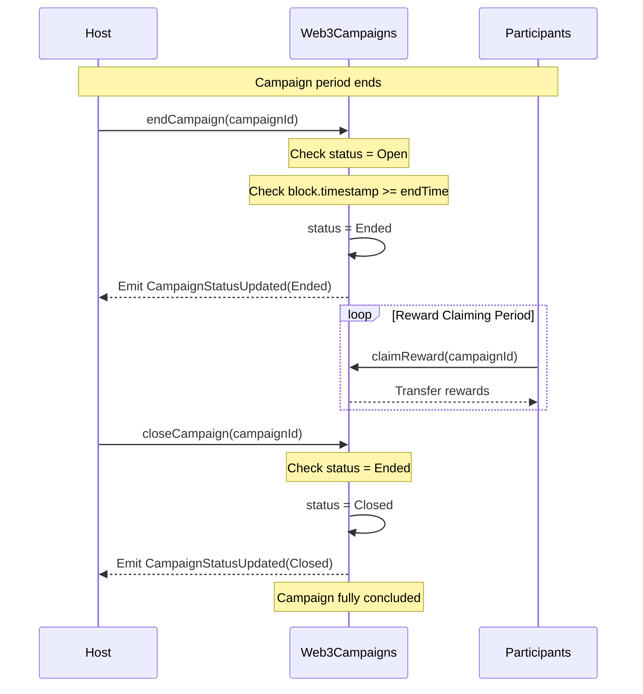

---

## 🔐 Security Features

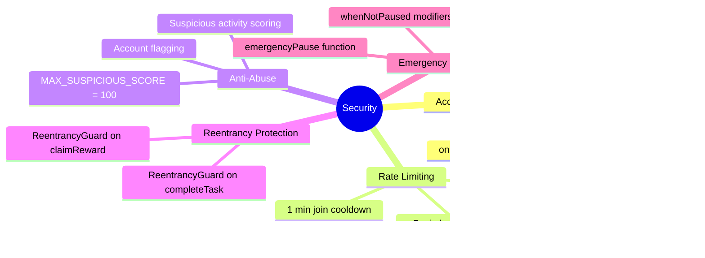

### Security Constants

| Constant | Value | Purpose |
|----------|-------|---------|
| `MIN_CAMPAIGN_DURATION` | 1 hour | Minimum campaign length |
| `MAX_CAMPAIGN_DURATION` | 365 days | Maximum campaign length |
| `MAX_PARTICIPANTS_LIMIT` | 100,000 | Per-campaign participant cap |
| `RATE_LIMIT_COOLDOWN` | 5 minutes | Time between host actions |
| `JOIN_COOLDOWN` | 1 minute | Time between participant joins |
| `MAX_SUSPICIOUS_SCORE` | 100 | Threshold for account flagging |

---

## 📋 View Functions Reference

| Function | Returns | Description |
|----------|---------|-------------|
| `getCampaign(id)` | Campaign struct | Full campaign details |
| `getCampaignTask(id, index)` | CampaignTask struct | Specific task data |
| `hasCompletedTask(id, participant, index)` | bool | Task completion status |
| `hasClaimedReward(id, participant)` | bool | Reward claim status |
| `getCampaignCount()` | uint256 | Total campaigns created |
| `getCampaignsByHost(host)` | uint256[] | Host's campaign IDs |
| `hasParticipated(id, participant)` | bool | Participation status |

---

## 🔄 Complete User Journey

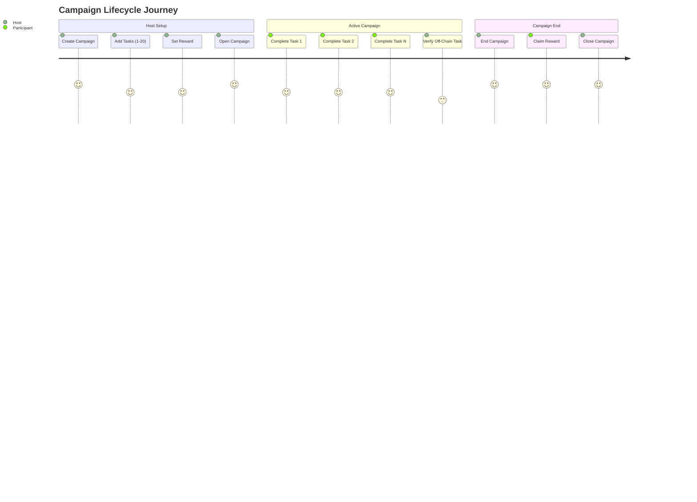

---

## 📝 Events Emitted

| Event | Parameters | When |
|-------|------------|------|
| `CampaignCreated` | campaignId, host, name, startTime, endTime | Campaign created |
| `TaskAddedToCampaign` | campaignId, taskId, taskType, description | Task added |
| `CampaignStatusUpdated` | campaignId, newStatus | Status changes |
| `ParticipantTaskCompleted` | campaignId, participant, taskId | Task completed |
| `RewardClaimed` | campaignId, participant, rewardType, tokenAddress, amount | Reward claimed |
| `RewardSet` | campaignId, rewardType, tokenAddress, amount | Reward configured |
| `EmergencyPause` | admin, timestamp | Contract paused |
| `EmergencyUnpause` | admin, timestamp | Contract unpaused |
| `SecurityViolationDetected` | user, reason | Security issue detected |
| `SuspiciousActivity` | user, activity | Suspicious behavior logged |
| `FundsReceived` | sender, amount | ETH received |

---

## 🛠️ Deployment

**Deploy Command:**
```bash
forge create ./src/Web3Campaigns.sol:Web3Campaigns \
    --rpc-url <your-rpc-url> \
    --account <your-account> \
    --verify \
    --etherscan-api-key <your-key> \
    --broadcast
```

---

## 📚 Quick Reference

### Host Actions
1. `grantHostRole(address)` - Grant HOST_ROLE
2. `createCampaign(name, startTime, endTime)` - Create new campaign
3. `addTaskToCampaign(id, type, desc, data, optional)` - Add task
4. **Reward Configuration (v0.1.0):**
   - `setERC20RewardFixed(id, token, amount)` - Fixed ERC20 per participant
   - `setERC20RewardTiered(id, token, startRanks[], endRanks[], amounts[])` - Tiered rewards
   - `setNFTReward(id, nftAddress, maxPerParticipant)` - Configure NFT distribution
   - `addNFTsToPool(id, tokenIds[])` - Add NFTs to distribution pool
   - `setOffChainReward(id, description, metadata)` - Off-chain rewards
   - `setCampaignReward(id, type, token, amount)` - Legacy (deprecated)
5. `openCampaign(id)` - Activate campaign
6. `verifyTaskCompletion(id, participant, taskIndex)` - Verify off-chain task
7. `endCampaign(id)` - End campaign
8. `closeCampaign(id)` - Close campaign

### Participant Actions
1. `completeTask(campaignId, taskIndex)` - Complete a task
2. `claimReward(campaignId)` - Claim reward after completing tasks

### View Functions (Rewards)
1. `getERC20RewardConfig(campaignId)` - Get ERC20 reward details
2. `getNFTRewardConfig(campaignId)` - Get NFT reward details
3. `getOffChainRewardConfig(campaignId)` - Get off-chain reward details
4. `getClaimRank(campaignId, participant)` - Get participant's claim order
5. `getRewardTiers(campaignId)` - Get tiered distribution config
6. `calculatePotentialReward(campaignId)` - Calculate expected rewards
7. `getNFTPoolStatus(campaignId)` - Get NFT pool availability

### Admin Actions
1. `emergencyPause()` - Pause contract
2. `emergencyUnpause()` - Unpause contract
3. `revokeHostRole(address)` - Revoke HOST_ROLE

